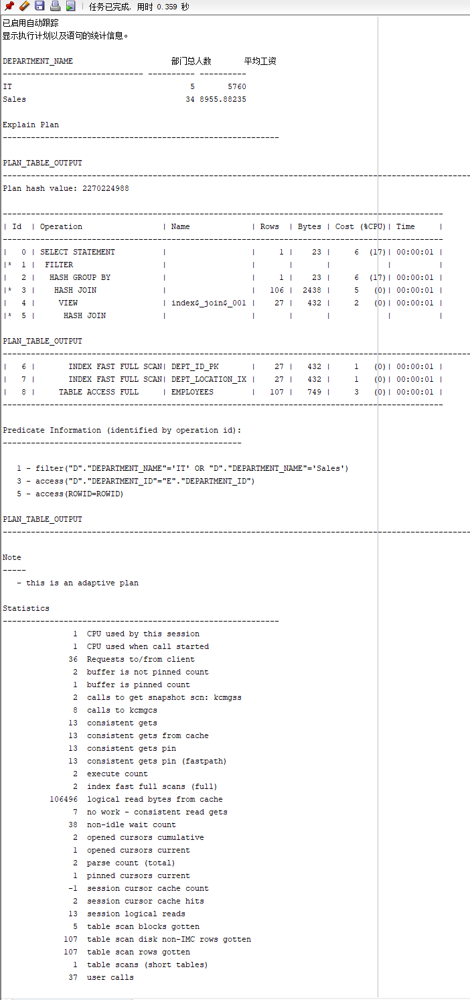

# 实验1： SQL语句的执行计划分析与优化指导

## 1. 实验目的

分析SQL执行计划，执行SQL语句的优化指导。理解分析SQL语句的执行计划的重要作用。

## 2. 实验内容

（1）对Oracle12c中的HR人力资源管理系统中的表进行查询与分析。

（2）首先运行和分析教材中的样例：本训练任务目的是查询两个部门('IT'和'Sales')的部门总人数和平均工资，以下两个查询的结果是一样的。但效率不相同。

（3）设计自己的查询语句，并作相应的分析，查询语句不能太简单。

## 3. 实验步骤

教材查询语句一:

```sql
set autotrace on

SELECT d.department_name,count(e.job_id)as "部门总人数",
avg(e.salary)as "平均工资"
from hr.departments d,hr.employees e
where d.department_id = e.department_id
and d.department_name in ('IT','Sales')
GROUP BY d.department_name;
```


教材查询语句二：

```sql
set autotrace on

SELECT d.department_name,count(e.job_id)as "部门总人数",
avg(e.salary)as "平均工资"
FROM hr.departments d,hr.employees e
WHERE d.department_id = e.department_id
GROUP BY d.department_name
HAVING d.department_name in ('IT','Sales');
```




第一条语句是最优的，

SQL Developer优化指导：


自己设计的查询语句：
```sql
set autotrace on

SELECT d.department_name,count(e.job_id)as "部门总人数",
avg(e.salary)as "平均工资",
max(e.salary)as "最高工资",
min(e.salary)as "最低工资"

from hr.departments d,hr.employees e
where d.department_id = e.department_id
and d.department_name in ('Marketing','Purchasing')
GROUP BY d.department_name;
```
通过上面查询语句，可以得到Marketing（营销），Purchasing（采购）的最高与最低工资，平均工资与部门总人数。

## 4. 实验总结
通过本次实验的学习，我接触了分析SQL执行计划，执行SQL语句的优化指导等内容。理解分析SQL语句的执行计划的重要作用。