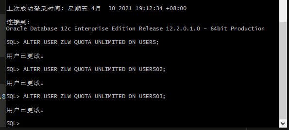
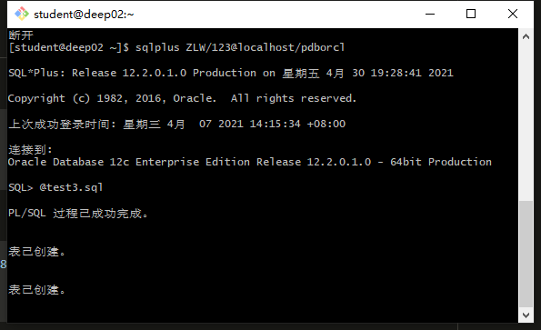
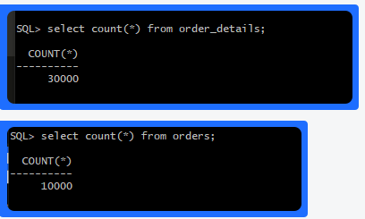
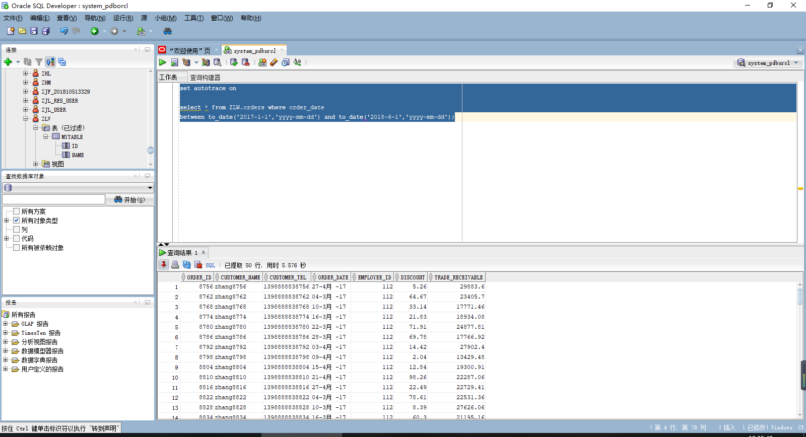
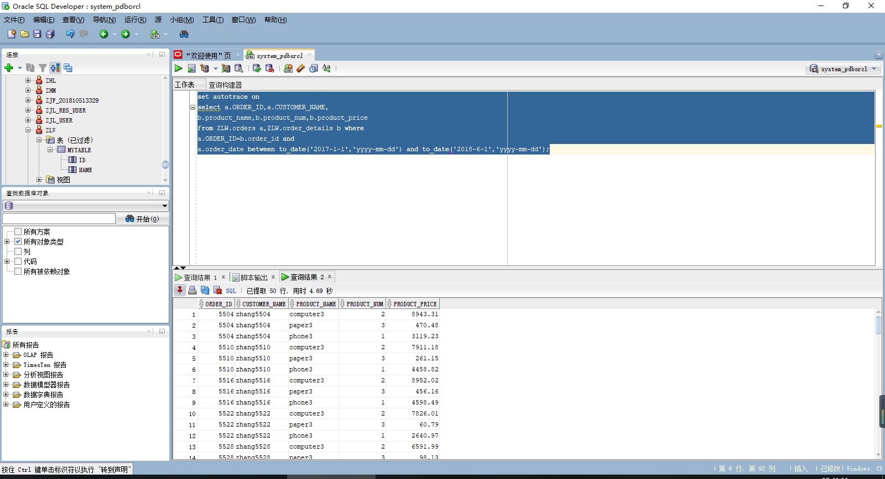
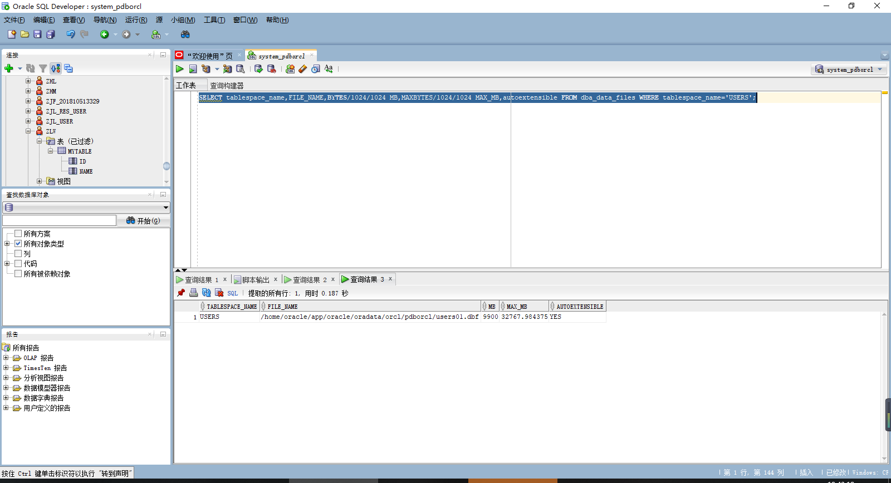
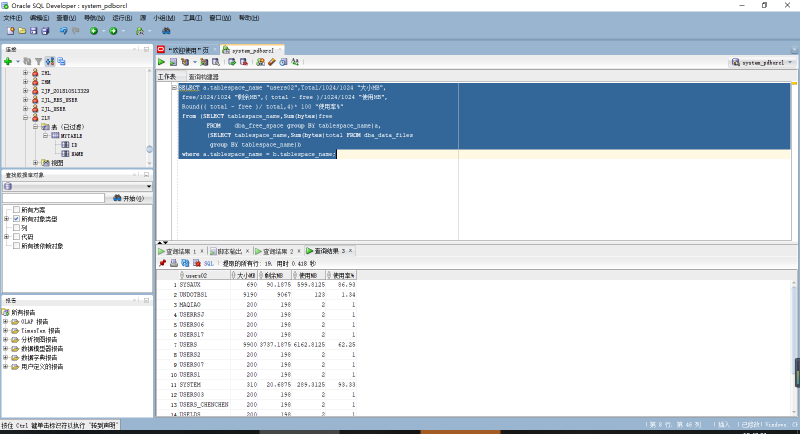

#作业3：创建分区表
##张露文  软件18-3  学号：201810414328
###实验目的
    掌握分区表的创建方法，掌握各种分区方式的使用场景。
###实验内容
      本实验使用3个表空间：USERS,USERS02,USERS03。在表空间中创
    建两张表：订单表(orders)与订单详表(order_details)。
        使用你自己的账号创建本实验的表，表创建在上述3个分区，自
    定义分区策略。
      你需要使用system用户给你自己的账号分配上述分区的使用权限。
      你需要使用system用户给你的用户分配可以查询执行计划的权限。
      表创建成功后，插入数据，数据能并平均分布到各个分区。每个表
    的数据都应该大于1万行，对表进行联合查询。
      写出插入数据的语句和查询数据的语句，并分析语句的执行计划。
      进行分区与不分区的对比实验。
###实验步骤：

####第1步：给用户ZLW创建3个表空间
SQL>ALTER USER your_user QUOTA UNLIMITED ON USERS;
SQL>ALTER USER your_user QUOTA UNLIMITED ON USERS02;
SQL>ALTER USER your_user QUOTA UNLIMITED ON USERS03;
SQL>exit

####结果：

####第2步：以ZLW身份登录,并运行脚本文件test3.sql:

####结果：

####第3步：查询两张表，验证数据插入:

####结果：

####第4步：以system身份登录,单表查询:

####结果：

####第5步：以system身份登录,联合查询:

####结果：

####第6步：查看表空间和数据库文件及其磁盘占用情况

####结果：

###总结体会
  通过这次实验，我学会使用表空间，在表空间中创建表
  学会使用system用户给你自己的账号分配上述分区的使用权限。system用户给你的用户分配可以查询执行计划的权限。
  插入数据，数据能并平均分布到各个分区。对表进行联合查询。
  分区表的优点有，改善查询性能，便于维护，增强其可用性，均衡I/O。

