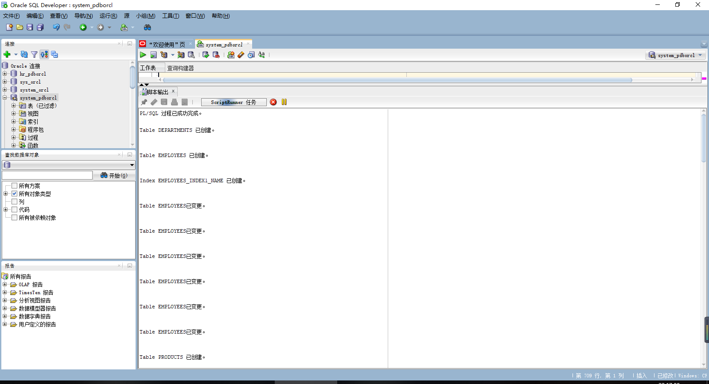
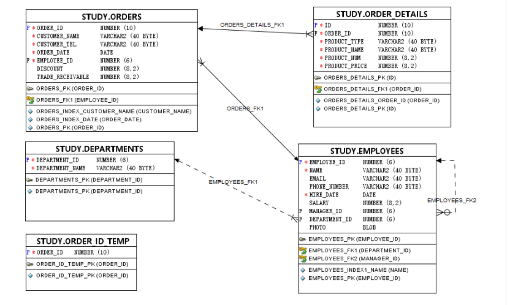
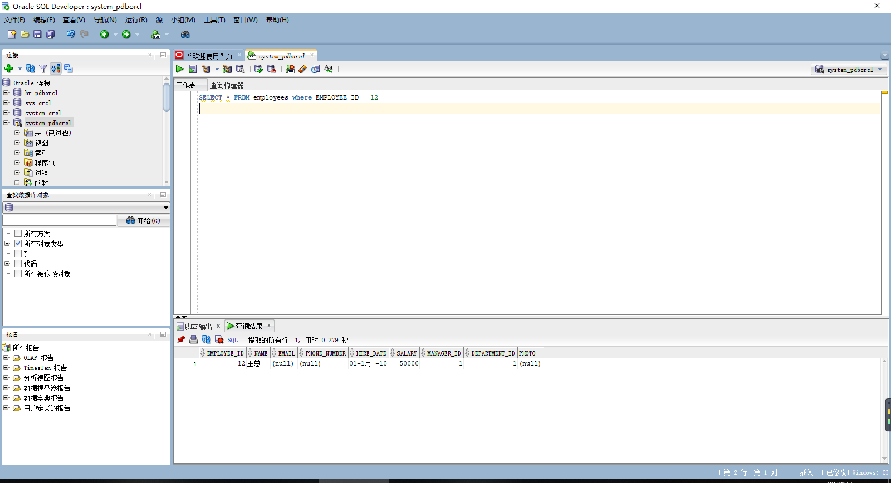
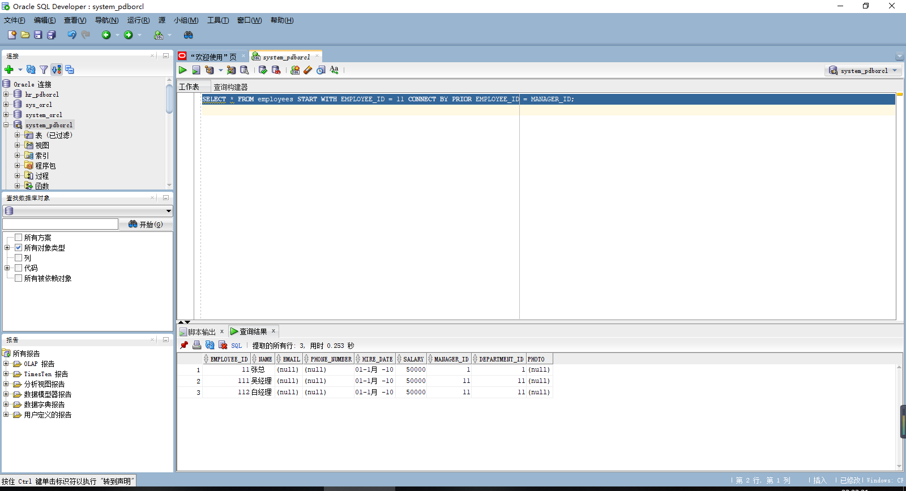
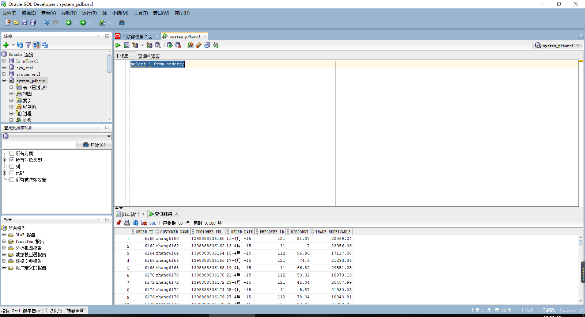
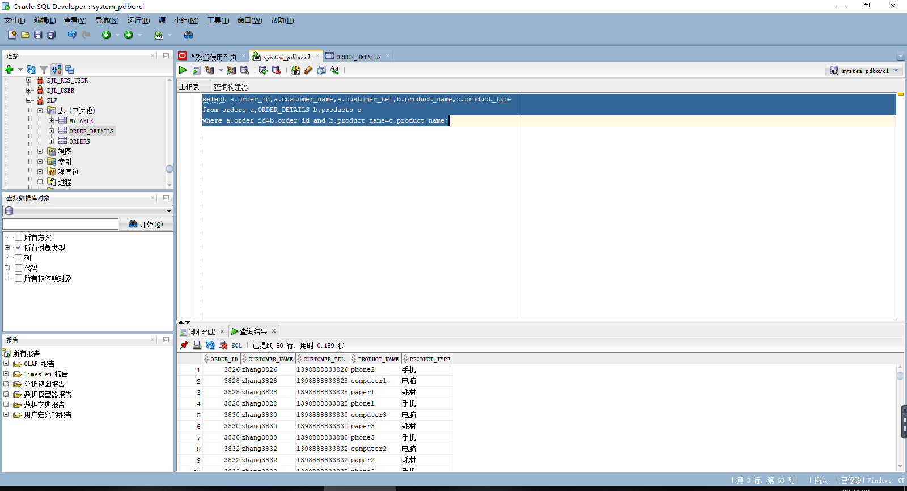
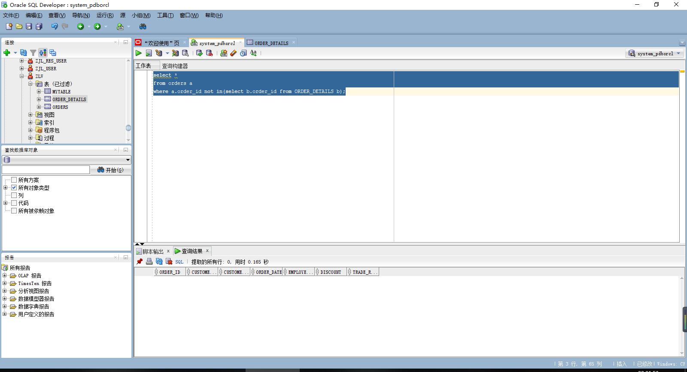
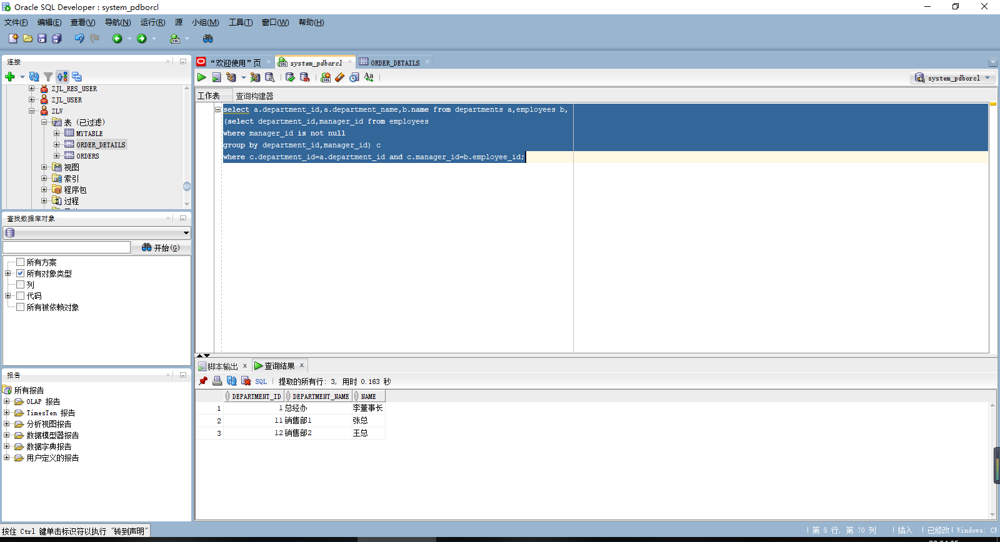
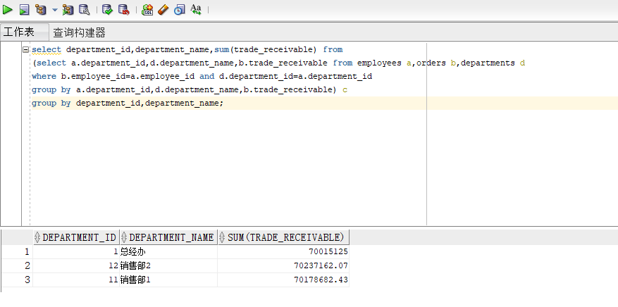

#作业4：对象管理
##张露文  软件18-3  学号：201810414328
###实验目的：
了解Oracle表和视图的概念，学习使用SQL语句Create Table创建表，学习Select语句插入，修改，删除以及查询数据，学习使用SQL语句创建视图，学习部分存储过程和触发器的使用。
###实验场景：
假设有一个生产某个产品的单位，单位接受网上订单进行产品的销售。通过实验模拟这个单位的部分信息：员工表，部门表，订单表，订单详单表。
###实验步骤：

####录入数据：
要求至少有1万个订单，每个订单至少有4个详单。至少有两个部门，每个部门至少有1个员工，其中只有一个人没有领导，一个领导至少有一个下属，并且它的下属是另一个人的领导（比如A领导B，B领导C）。
####序列的应用：
插入ORDERS和ORDER_DETAILS 两个表的数据时，主键ORDERS.ORDER_ID, ORDER_DETAILS.ID的值必须通过序列SEQ_ORDER_ID和SEQ_ORDER_ID取得，不能手工输入一个数字。
####触发器的应用：
维护ORDER_DETAILS的数据时（insert,delete,update）要同步更新ORDERS表订单应收货款ORDERS.Trade_Receivable的值。
####运行test4.sql

####数据关系图：

####查询数据：
1.查询某个员工的信息

2.递归查询某个员工及其所有下属，子下属员工。

3.查询订单表，并且包括订单的订单应收货款: Trade_Receivable= sum(订单详单表.ProductNum*订单详单表.ProductPrice)- Discount。

4.查询订单详表，要求显示订单的客户名称和客户电话，产品类型用汉字描述。

5.查询出所有空订单，即没有订单详单的订单。

6.查询部门表，同时显示部门的负责人姓名。

7.查询部门表，统计每个部门的销售总金额。

##实验总结 通过本次实验我了解Oracle表和视图的概念，学习使用SQL语句Create Table创建表，学习Select语句插入，修改，删除以及查询数据，学习使用SQL语句创建视图，学习部分存储过程和触发器的使用。