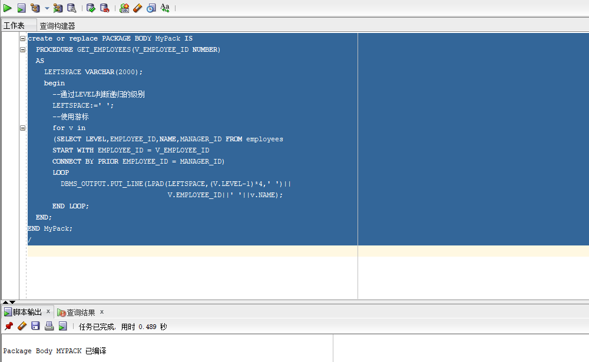

#作业4：对象管理
##张露文  软件18-3  学号：201810414328
###实验目的：
了解PL/SQL语言结构 了解PL/SQL变量和常量的声明和使用方法 学习条件语句的使用方法 学习分支语句的使用方法 学习循环语句的使用方法 学习常用的PL/SQL函数 学习包，过程，函数的用法。

###实验场景：
假设有一个生产某个产品的单位，单位接受网上订单进行产品的销售。通过实验模拟这个单位的部分信息：员工表，部门表，订单表，订单详单表。 本实验以实验四为基础

###实验步骤：

####创建一个包(Package)，包名是MyPack。

####在MyPack中创建一个函数SaleAmount ，查询部门表，统计每个部门的销售总金额，每个部门的销售额是由该部门的员工(ORDERS.EMPLOYEE_ID)完成的销售额之和。函数SaleAmount要求输入的参数是部门号，输出部门的销售金额。

####测试

####在MyPack中创建一个过程，在过程中使用游标，递归查询某个员工及其所有下属，子下属员工。过程的输入参数是员工号，输出员工的ID,姓名，销售总金额。信息用dbms_output包中的put或者put_line函数。输出的员工信息用左添加空格的多少表示员工的层次（LEVEL）。比如下面显示5个员工的信息：

####测试

##实验总结 通过本次实验我了解PL/SQL语言结构 了解PL/SQL变量和常量的声明和使用方法 学习条件语句的使用方法 学习分支语句的使用方法 学习循环语句的使用方法 学习常用的PL/SQL函数 学习包，过程，函数的用法。