## 数据库设计
### 1. 添加用户及权限管理
oracle中的表就是一张存储数据的表。表空间是逻辑上的划分。方便管理的。
数据表空间 (Tablespace) 
存放数据总是需要空间， Oracle把一个数据库按功能划分若干空间来保存数据。当然数据存放在磁盘最终是以文件形式，所以一盘一个数据表空间包含一个以上的物理文件
数据表。
在仓库，我们可能有多间房子，每个房子又有多个货架，每架又有多层。 我们在数据库中存放数据，最终是数据表的单元来存储与管理的。
数据文件。
以上几个概念都是逻辑上的， 而数据文件则是物理上的。就是说，数据文件是真正“看得着的东西”，它在磁盘上以一个真实的文件体现。

创建表空间 USERS02：
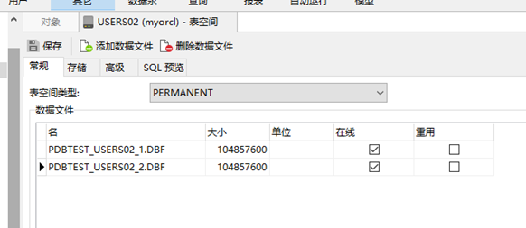
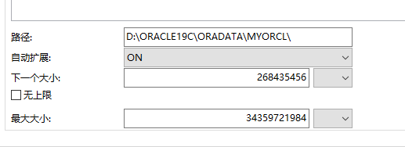
建好tablespace, 就可以建用户
 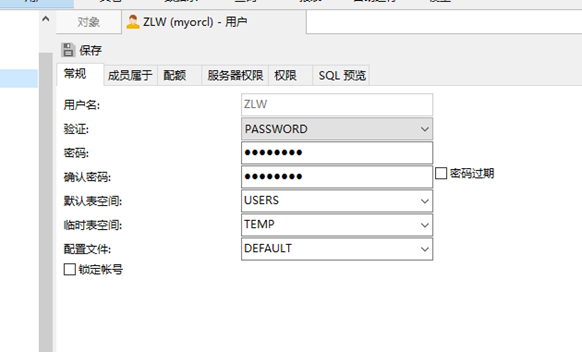
成员属于这点上 Connect和Recourse：
 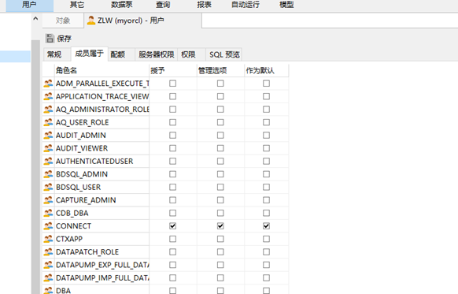
授权 create view：
  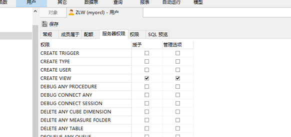
配额：

  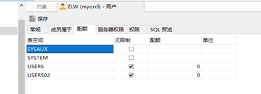

使用ZLW用户登录本地Oracle数据库
  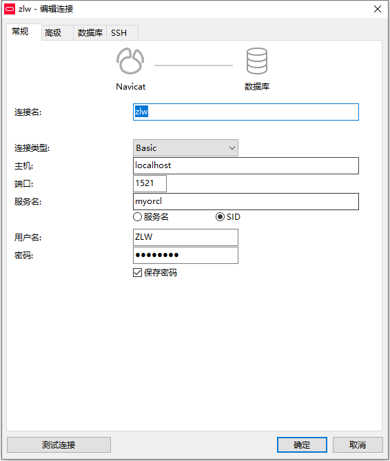

###  利用新创建的用户ZLW创建了五个表 
  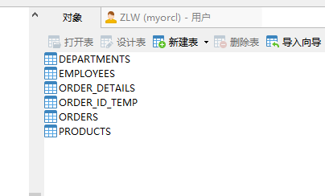

```  
  DECLARE num NUMBER;
BEGIN
	SELECT
		count( 1 ) INTO num 
	FROM
		user_tables 
	WHERE
		TABLE_NAME = 'DEPARTMENTS';
	IF
		num = 1 THEN
			execute IMMEDIATE 'drop table DEPARTMENTS cascade constraints PURGE';
		
	END IF;
	SELECT
		count( 1 ) INTO num 
	FROM
		user_tables 
	WHERE
		TABLE_NAME = 'EMPLOYEES';
	IF
		num = 1 THEN
			execute IMMEDIATE 'drop table EMPLOYEES cascade constraints PURGE';
		
	END IF;
	SELECT
		count( 1 ) INTO num 
	FROM
		user_tables 
	WHERE
		TABLE_NAME = 'ORDER_ID_TEMP';
	IF
		num = 1 THEN
			execute IMMEDIATE 'drop table ORDER_ID_TEMP cascade constraints PURGE';
		
	END IF;
	SELECT
		count( 1 ) INTO num 
	FROM
		user_tables 
	WHERE
		TABLE_NAME = 'ORDER_DETAILS';
	IF
		num = 1 THEN
			execute IMMEDIATE 'drop table ORDER_DETAILS cascade constraints PURGE';
		
	END IF;
	SELECT
		count( 1 ) INTO num 
	FROM
		user_tables 
	WHERE
		TABLE_NAME = 'ORDERS';
	IF
		num = 1 THEN
			execute IMMEDIATE 'drop table ORDERS cascade constraints PURGE';
		
	END IF;
	SELECT
		count( 1 ) INTO num 
	FROM
		user_tables 
	WHERE
		TABLE_NAME = 'PRODUCTS';
	IF
		num = 1 THEN
			execute IMMEDIATE 'drop table PRODUCTS cascade constraints PURGE';
		
	END IF;
	SELECT
		count( 1 ) INTO num 
	FROM
		user_sequences 
	WHERE
		SEQUENCE_NAME = 'SEQ_ORDER_DETAILS_ID';
	IF
		num = 1 THEN
			execute IMMEDIATE 'drop  SEQUENCE SEQ_ORDER_DETAILS_ID';
		
	END IF;
	SELECT
		count( 1 ) INTO num 
	FROM
		user_sequences 
	WHERE
		SEQUENCE_NAME = 'SEQ_ORDER_ID';
	IF
		num = 1 THEN
			execute IMMEDIATE 'drop  SEQUENCE SEQ_ORDER_ID';
		
	END IF;
	SELECT
		count( 1 ) INTO num 
	FROM
		user_views 
	WHERE
		VIEW_NAME = 'VIEW_ORDER_DETAILS';
	IF
		num = 1 THEN
			execute IMMEDIATE 'drop VIEW VIEW_ORDER_DETAILS';
		
	END IF;
	SELECT
		count( object_name ) INTO num 
	FROM
		user_objects_ae 
	WHERE
		object_type = 'PACKAGE' 
		AND OBJECT_NAME = 'MYPACK';
	IF
		num = 1 THEN
			execute IMMEDIATE 'DROP PACKAGE MYPACK';
		
	END IF;
	
END;
/

CREATE TABLE DEPARTMENTS (
	DEPARTMENT_ID NUMBER ( 6, 0 ) NOT NULL,
	DEPARTMENT_NAME VARCHAR2 ( 40 BYTE ) NOT NULL,
	CONSTRAINT DEPARTMENTS_PK PRIMARY KEY ( DEPARTMENT_ID )
	);

CREATE TABLE EMPLOYEES (
	EMPLOYEE_ID NUMBER ( 6, 0 ) NOT NULL,
	NAME VARCHAR2 ( 40 BYTE ) NOT NULL,
	EMAIL VARCHAR2 ( 40 BYTE ),
	PHONE_NUMBER VARCHAR2 ( 40 BYTE ),
	HIRE_DATE DATE NOT NULL,
	SALARY NUMBER ( 8, 2 ),
	MANAGER_ID NUMBER ( 6, 0 ),
	DEPARTMENT_ID NUMBER ( 6, 0 ),
	PHOTO BLOB,
	CONSTRAINT EMPLOYEES_PK PRIMARY KEY ( EMPLOYEE_ID )
	);
	
	
	CREATE TABLE PRODUCTS (
	PRODUCT_NAME VARCHAR2 ( 40 BYTE ) NOT NULL,
	PRODUCT_TYPE VARCHAR2 ( 40 BYTE ) NOT NULL,
	CONSTRAINT PRODUCTS_PK PRIMARY KEY ( PRODUCT_NAME )
	);


CREATE GLOBAL TEMPORARY TABLE "ORDER_ID_TEMP" ( "ORDER_ID" NUMBER ( 10, 0 ) NOT NULL ENABLE, CONSTRAINT "ORDER_ID_TEMP_PK" PRIMARY KEY ( "ORDER_ID" ) ENABLE ) ON COMMIT DELETE ROWS;


COMMENT ON TABLE "ORDER_ID_TEMP" IS '用于触发器存储临时ORDER_ID';


CREATE TABLE ORDERS (
	ORDER_ID NUMBER ( 10, 0 ) NOT NULL,
	CUSTOMER_NAME VARCHAR2 ( 40 BYTE ) NOT NULL,
	CUSTOMER_TEL VARCHAR2 ( 40 BYTE ) NOT NULL,
	ORDER_DATE DATE NOT NULL,
	DEPARMENT_ID NUMBER ( 6, 0 ) NOT NULL,

	TRADE_RECEIVABLE NUMBER ( 8, 2 ) DEFAULT 0 
	) TABLESPACE USERS PCTFREE 10 INITRANS 1 STORAGE ( BUFFER_POOL DEFAULT ) NOCOMPRESS NOPARALLEL PARTITION BY RANGE ( ORDER_DATE ) (
	
	PARTITION PARTITION_BEFORE_2016
	VALUES
		LESS THAN (
		TO_DATE( ' 2016-01-01 00:00:00', 'SYYYY-MM-DD HH24:MI:SS', 'NLS_CALENDAR=GREGORIAN' )) NOLOGGING TABLESPACE USERS PCTFREE 10 INITRANS 1 STORAGE ( INITIAL 8388608 NEXT 1048576 MINEXTENTS 1 MAXEXTENTS UNLIMITED BUFFER_POOL DEFAULT ) NOCOMPRESS NO INMEMORY,
		PARTITION PARTITION_BEFORE_2017
	VALUES
		LESS THAN (
		TO_DATE( ' 2017-01-01 00:00:00', 'SYYYY-MM-DD HH24:MI:SS', 'NLS_CALENDAR=GREGORIAN' )) NOLOGGING TABLESPACE USERS02 PCTFREE 10 INITRANS 1 STORAGE ( INITIAL 8388608 NEXT 1048576 MINEXTENTS 1 MAXEXTENTS UNLIMITED BUFFER_POOL DEFAULT ) NOCOMPRESS NO INMEMORY 
	);
	
	
	CREATE INDEX ORDERS_INDEX_DATE ON ORDERS ( ORDER_DATE ASC ) LOCAL (
	PARTITION PARTITION_BEFORE_2016 TABLESPACE USERS PCTFREE 10 INITRANS 2 STORAGE ( INITIAL 8388608 NEXT 1048576 MINEXTENTS 1 MAXEXTENTS UNLIMITED BUFFER_POOL DEFAULT ) NOCOMPRESS,
	PARTITION PARTITION_BEFORE_2017 TABLESPACE USERS02 PCTFREE 10 INITRANS 2 STORAGE ( INITIAL 8388608 NEXT 1048576 MINEXTENTS 1 MAXEXTENTS UNLIMITED BUFFER_POOL DEFAULT ) NOCOMPRESS 
) STORAGE ( BUFFER_POOL DEFAULT ) NOPARALLEL;


CREATE UNIQUE INDEX ORDERS_PK ON ORDERS ( ORDER_ID ASC ) GLOBAL PARTITION BY HASH ( ORDER_ID ) ( PARTITION INDEX_PARTITION1 TABLESPACE USERS NOCOMPRESS, PARTITION INDEX_PARTITION2 TABLESPACE USERS02 NOCOMPRESS ) NOLOGGING TABLESPACE USERS PCTFREE 10 INITRANS 2 STORAGE ( INITIAL 65536 NEXT 1048576 MINEXTENTS 1 MAXEXTENTS UNLIMITED BUFFER_POOL DEFAULT ) NOPARALLEL;

ALTER TABLE ORDERS ADD CONSTRAINT ORDERS_PK PRIMARY KEY ( ORDER_ID ) USING INDEX ORDERS_PK ENABLE;

	
CREATE TABLE ORDER_DETAILS (
	ID NUMBER ( 10, 0 ) NOT NULL,
	ORDER_ID NUMBER ( 10, 0 ) NOT NULL,
	PRODUCT_NAME VARCHAR2 ( 40 BYTE ) NOT NULL,
	PRODUCT_NUM NUMBER ( 8, 2 ) NOT NULL,
	PRODUCT_PRICE NUMBER ( 8, 2 ) NOT NULL,
	CONSTRAINT ORDER_DETAILS_FK1 FOREIGN KEY ( ORDER_ID ) REFERENCES ORDERS ( ORDER_ID ) ENABLE 
	) TABLESPACE USERS PCTFREE 10 INITRANS 1 STORAGE ( BUFFER_POOL DEFAULT ) NOCOMPRESS NOPARALLEL PARTITION BY REFERENCE ( ORDER_DETAILS_FK1 ) (
	PARTITION PARTITION_BEFORE_2016 NOLOGGING TABLESPACE USERS --必须指定表空间，否则会将分区存储在用户的默认表空间中
	PCTFREE 10 INITRANS 1 STORAGE ( INITIAL 8388608 NEXT 1048576 MINEXTENTS 1 MAXEXTENTS UNLIMITED BUFFER_POOL DEFAULT ) NOCOMPRESS NO INMEMORY,
	PARTITION PARTITION_BEFORE_2017 NOLOGGING TABLESPACE USERS02 PCTFREE 10 INITRANS 1 STORAGE ( INITIAL 8388608 NEXT 1048576 MINEXTENTS 1 MAXEXTENTS UNLIMITED BUFFER_POOL DEFAULT ) NOCOMPRESS NO INMEMORY 
);
CREATE UNIQUE INDEX ORDER_DETAILS_PK ON ORDER_DETAILS ( ID ASC ) NOLOGGING TABLESPACE USERS PCTFREE 10 INITRANS 2 STORAGE ( INITIAL 65536 NEXT 1048576 MINEXTENTS 1 MAXEXTENTS UNLIMITED BUFFER_POOL DEFAULT ) NOPARALLEL;
ALTER TABLE ORDER_DETAILS ADD CONSTRAINT ORDER_DETAILS_PK PRIMARY KEY ( ID ) USING INDEX ORDER_DETAILS_PK ENABLE;

CREATE SEQUENCE SEQ_ORDER_ID INCREMENT BY 1 START WITH 1 MAXVALUE 999999999 MINVALUE 1 CACHE 20 ORDER;
CREATE SEQUENCE SEQ_ORDER_DETAILS_ID INCREMENT BY 1 START WITH 1 MAXVALUE 999999999 MINVALUE 1 CACHE 20 ORDER;

```
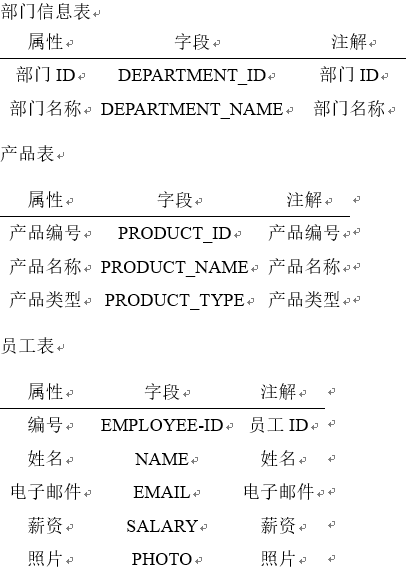
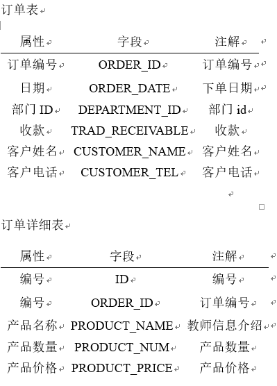


## 创建视图
•	视图(view)，也称虚表, 不占用物理空间，这个也是相对概念，因为视图本身的定义语句还是要存储在数据字典里的。视图只有逻辑定义。每次使用的时候,只是重新执行SQL。
•	视图是从一个或多个实际表中获得的，这些表的数据存放在数据库中。那些用于产生视图的表叫做该视图的基表。一个视图也可以从另一个视图中产生。
•	视图的定义存在数据库中，与此定义相关的数据并没有再存一份于数据库中。通过视图看到的数据存放在基表中。
•	视图看上去非常象数据库的物理表，对它的操作同任何其它的表一样。当通过视图修改数据时，实际上是在改变基表中的数据；相反地，基表数据的改变也会自动反映在由基表产生的视图中。由于逻辑上的原因，有些Oracle视图可以修改对应的基表，有些则不能（仅仅能查询）。
•	还有一种视图：物化视图（MATERIALIZED VIEW ），也称实体化视图，快照 （8i 以前的说法） ，它是含有数据的，占用存储空间。
```
•	CREATE 
•		OR REPLACE FORCE EDITIONABLE VIEW "VIEW_ORDER_DETAILS" ( "ID", "ORDER_ID", "CUSTOMER_NAME", "CUSTOMER_TEL", "ORDER_DATE", "PRODUCT_TYPE", "PRODUCT_NAME", "PRODUCT_NUM", "PRODUCT_PRICE" ) AS SELECT
•		d.ID,
•		o.ORDER_ID,
•		o.CUSTOMER_NAME,
•		o.CUSTOMER_TEL,
•		o.ORDER_DATE,
•		p.PRODUCT_TYPE,
•		d.PRODUCT_NAME,
•		d.PRODUCT_NUM,
•		d.PRODUCT_PRICE 
•	FROM
•		ORDERS o,
•		ORDER_DETAILS d,
•		PRODUCTS p 
•	WHERE
•		d.ORDER_ID = o.ORDER_ID 
•		AND d.PRODUCT_NAME = p.PRODUCT_NAME;
•		

8. 向数据库中写入数据共计50000多个数据
declare
  dt date;
  m number(8,2);

  V_department_ID NUMBER(6);
  v_order_id number(10);
  v_name VARCHAR2 ( 100 );
	v_tel VARCHAR2 ( 100 );
  v number(10,2);

begin
  for i in 1..10000
  loop
    if i mod 2 =0 then
      dt:=to_date('2015-3-2','yyyy-mm-dd')+(i mod 60);
    else
      dt:=to_date('2016-3-2','yyyy-mm-dd')+(i mod 60);
    end if;
		
		
   V_department_ID:=CASE I MOD 3 + 1 WHEN 1 THEN 1 WHEN 2 THEN 2 ELSE 3 END;   
    v_order_id:=SEQ_ORDER_ID.nextval; --应该将SEQ_ORDER_ID.nextval保存到
		v_name:=
		CASE
			I MOD 6 
			WHEN 0 THEN
			'zhang' || i mod 100
			WHEN 1 THEN
			'li' || i mod 100
			WHEN 2 THEN
			'huang' || i mod 100
			WHEN 3 THEN
			'yi' || i mod 100
			WHEN 4 THEN
			'ping' || i mod 100 ELSE 'yin' || i mod 100
		END;
		
		v_tel := '139888883' || i;
  
    insert /*+append*/ into ORDERS (ORDER_ID, CUSTOMER_NAME, CUSTOMER_TEL, ORDER_DATE,DEPARMTENT_ID)
      values (v_order_id,v_name,v_tel,dt,V_department_ID);

--插入订单y一个订单包括3个产品

    v:=dbms_random.value(1000,800);
    v_name:='香水'|| (i mod 3 + 1);
    insert /*+append*/ into ORDER_DETAILS(ID,ORDER_ID,PRODUCT_NAME,PRODUCT_NUM,PRODUCT_PRICE)
		  values (SEQ_ORDER_DETAILS_ID.NEXTVAL,v_order_id,v_name,1,v);
			
    v:=dbms_random.value(1000,800);
    v_name:='化妆品'|| (i mod 3 + 1);
    insert /*+append*/ into ORDER_DETAILS(ID,ORDER_ID,PRODUCT_NAME,PRODUCT_NUM,PRODUCT_PRICE)
      values (SEQ_ORDER_DETAILS_ID.NEXTVAL,v_order_id,v_name,1,v);
    v:=dbms_random.value(1000,800);
    v_name:='护肤品'|| (i mod 3 + 1);
    insert /*+append*/ into ORDER_DETAILS(ID,ORDER_ID,PRODUCT_NAME,PRODUCT_NUM,PRODUCT_PRICE)
      values (SEQ_ORDER_DETAILS_ID.NEXTVAL,v_order_id,v_name,1,v);
			
			
    --在触发器关闭的情况下，需要手工计算每个订单的应收金额：
    select sum(PRODUCT_NUM*PRODUCT_PRICE) into m from ORDER_DETAILS where ORDER_ID=v_order_id;
    if m is null then
     m:=0;
    end if;
   UPDATE ORDERS SET TRADE_RECEIVABLE = m  WHERE ORDER_ID=v_order_id;
    IF I MOD 1000 =0 THEN
      commit; --每次提交会加快插入数据的速度
    END IF;
  end loop;
  --统计用户的所有表，所需时间很长：2千万行数据，需要1600秒，该语句可选
  --dbms_stats.gather_schema_stats(User,estimate_percent=>100,cascade=> TRUE); --estimate_percent采样行的百分比
end;
/


--最后动态增加一个PARTITION_BEFORE_2018分区：
ALTER TABLE ORDERS
ADD PARTITION PARTITION_BEFORE_2018 VALUES LESS THAN (TO_DATE(' 2018-01-01 00:00:00', 'SYYYY-MM-DD HH24:MI:SS', 'NLS_CALENDAR=GREGORIAN'));

ALTER INDEX ORDERS_INDEX_DATE
MODIFY PARTITION PARTITION_BEFORE_2018
NOCOMPRESS;
代码截图：
 ```
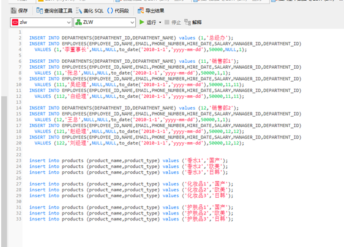
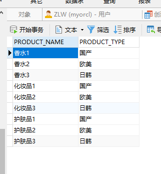
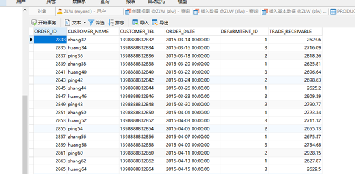
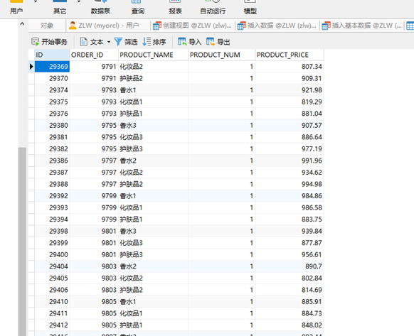
 
9. PL/SQL设计
 过程和函数由以下4部分： 
•	签名或头
•	关键字IS或AS
•	局部声明（可选）
•	BEGIN和END之间的过程体（包括异常处理程序）
 简单示例： 
 ```
create or replace procedure show_line(ip_line_length in number, ip_separator in varchar2)
is 
actual_line varchar2(150);
begin
     insert into t_user(id,name,sex)values(ip_line_length,ip_separator,ip_line_length);
     for idx in 1..ip_line_length loop
         actual_line := actual_line||ip_separator;
     end loop;
     dbms_output.put_line(actual_line);
exception when others then
          dbms_output.put_line(SQLERRM);
end;
如下调用：
begin    show_line(50,'=');end;/
在SQLPLUS里面调用：
SQL> BEGIN2        show_line(50,'=');3    END;

 几点说明：
1、参数没有指定长度，当有实际数据传递进来的时候，参数的长度才被确定。
2、局部声明为：actual_line varchar2(150);
3、使用命令SQL> show errors在SQLPLUS里面查看错误。
9.2. 创建函数
9.2.1. 查询部门所属总销售额
CREATE OR REPLACE
PACKAGE BODY "MYPACK" AS FUNCTION Get_SaleAmount ( DEPARTMENT_ID NUMBER ) RETURN NUMBER AS N NUMBER ( 20, 2 );
BEGIN
      SELECT SUM(O.TRADE_RECEIVABLE) into N  FROM ORDERS O,DEPARTMENTS D
      WHERE O.DEPARTMENT_ID=D.DEPARTMENT_ID AND D.DEPARTMENT_ID ="门店号";
      RETURN N;
    END;
END; 
```
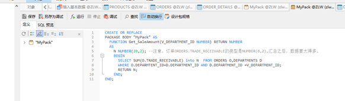
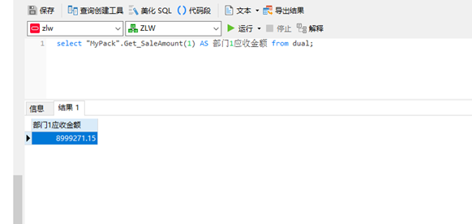
9.2.2. 测试
 

10. 数据库备份
ORACLE数据库备份与恢复详解
Oracle的备份与恢复有三种标准的模式，大致分为两 大类，备份恢复(物理上的)以及导入导出(逻辑上的)，而备份恢复又可以根据数据库的工作模式分为非归档模式(Nonarchivelog-style) 和归档模式(Archivelog-style),通常，我们把非归档模式称为冷备份，而相应的把归档模式称为热备份。
热备份和冷备份优缺点
热备份的优点是：
 1．可在表空间或数据文件级备份，备份时间短。 
 2．备份时数据库仍可使用。 
 3．可达到秒级恢复（恢复到某一时间点上）。 
 4．可对几乎所有数据库实体作恢复。 
 5．恢复是快速的，在大多数情况下在数据库仍工作时恢复。 
热备份的不足是：
 1．不能出错，否则后果严重。 
 2．若热备份不成功，所得结果不可用于时间点的恢复。 
 3．因难维护，所以要特别仔细小心，不允许“以失败而告终”。 
冷备份的优点是：
 1．是非常快速的备份方法（只需拷贝文件） 
 2．容易归档（简单拷贝即可） 
 3．容易恢复到某个时间点上（只需将文件再拷贝回去） 
 4．能与归档方法相结合，作数据库“最新状态”的恢复。 
 5．低度维护，高度安全。 
冷备份不足是：
 1．单独使用时，只能提供到“某一时间点上”的恢复。 
 2．在实施备份的全过程中，数据库必须要作备份而不能作其它工作。也就是说，数据库必须是关闭状态。
 3．若磁盘空间有限，只能拷贝到磁带等其它外部存储设备上，速度会很慢。 
 4．不能按表或按用户恢复。
物理备份之冷备份：
 当数据库可以暂时处于关闭状态时，我们需要将它在这一稳定时刻的数据相关文件转移到安全的区域，当数据库遭到破坏，再从安全区域将备份的数据库相关文件拷 贝回原来的位置，这样，就完成了一次快捷安全等数据转移。由于是在数据库不提供服务的关闭状态，所以称为冷备份。冷备份具有很多优良特性，比如上面图中我 们提到的，快速，方便，以及高效。一次完整的冷备份步骤应该是：
 1，首先关闭数据库（shutdown normal）
 2，拷贝相关文件到安全区域（利用操作系统命令拷贝数据库的所有的数据文件、日志文件、控制文件、参数文件、口令文件等（包括路径））
 3，重新启动数据库（startup）
这样，我们就完成了一次冷备份，请确定你对这些相应的目录（包括写入的目标文件夹）有相应的权限。
 恢复的时候，相对比较简单了，我们停掉数据库，将文件拷贝回相应位置，重启数据库就可以了，当然也可以用脚本来完成。
10.1. 手动数据库备份之数据库导出expdp

步骤：
SQL plus 已SYSTEM 用户登录
创建expdir目录并给ZLW用户授权读写
 

 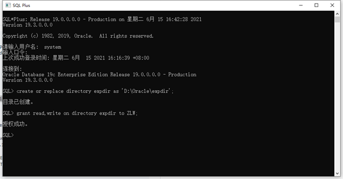
用户自己备份
 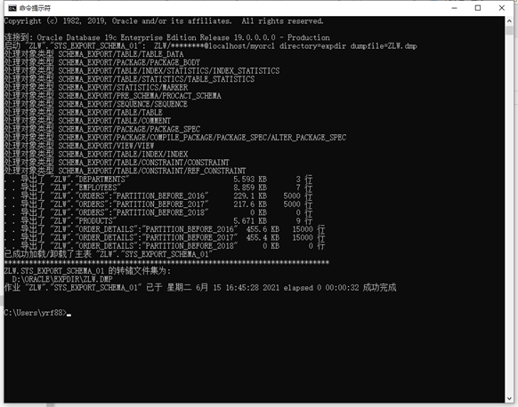
前往本地目录查看：
 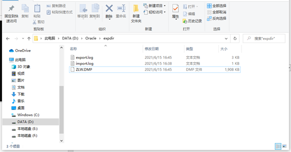
10.5. 删除数据库文件模拟数据损坏
 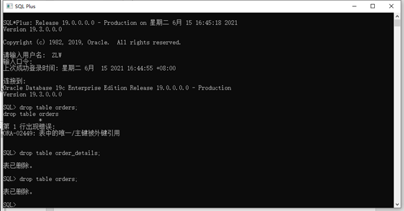
10.6. 数据库完全恢复
 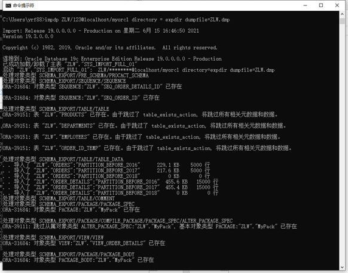
用户ZLW登录数据库查看恢复情况;
 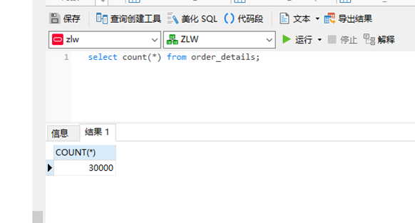
恢复成功。
